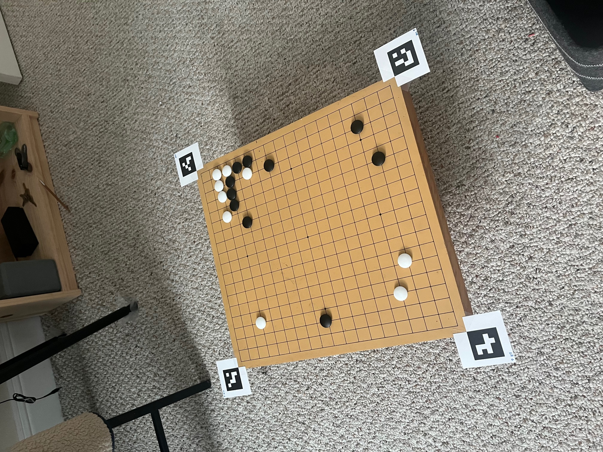
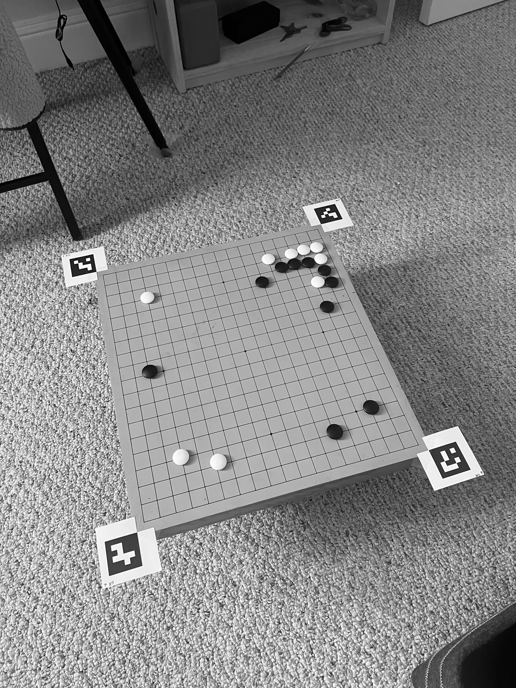
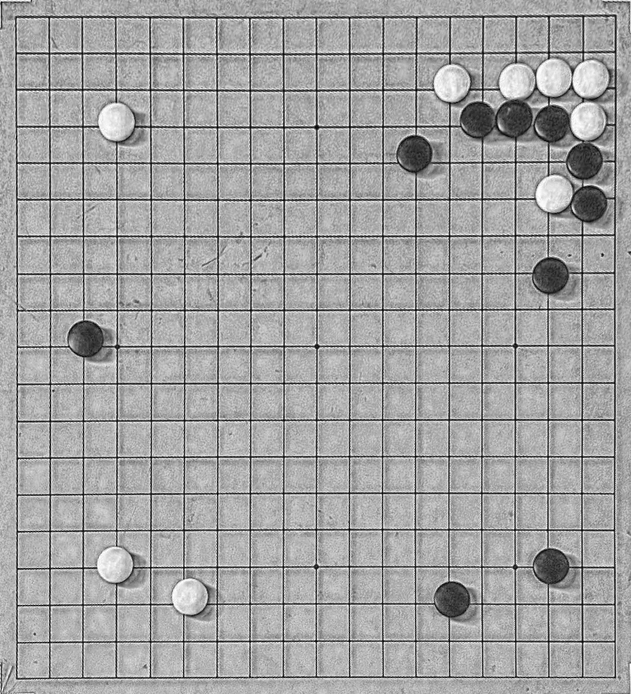
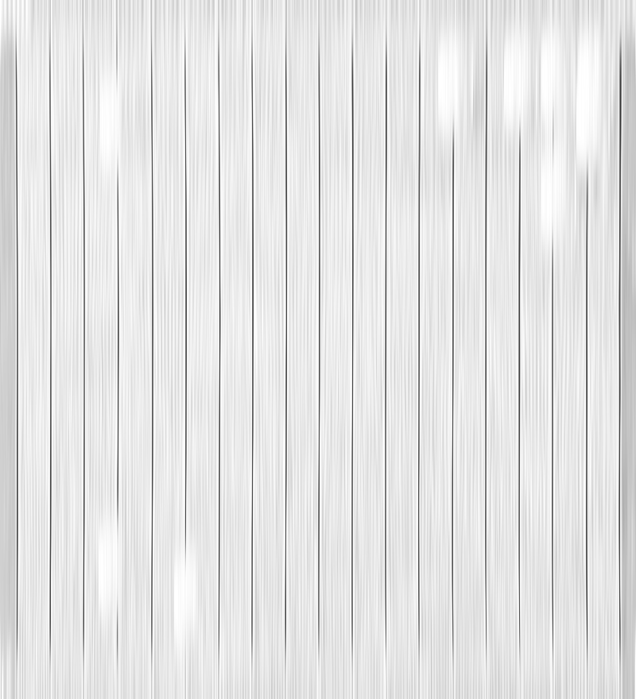
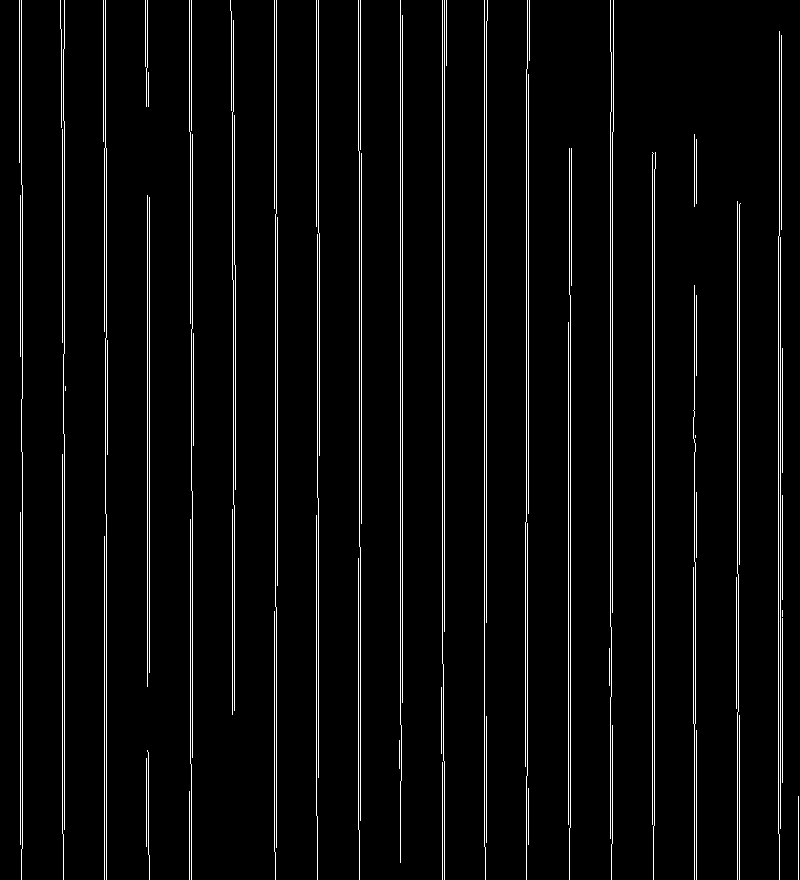
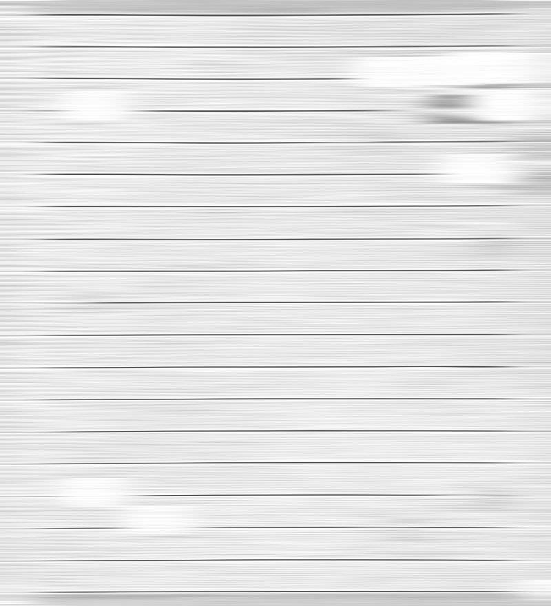
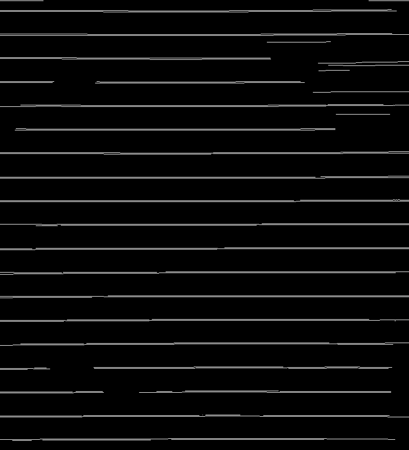
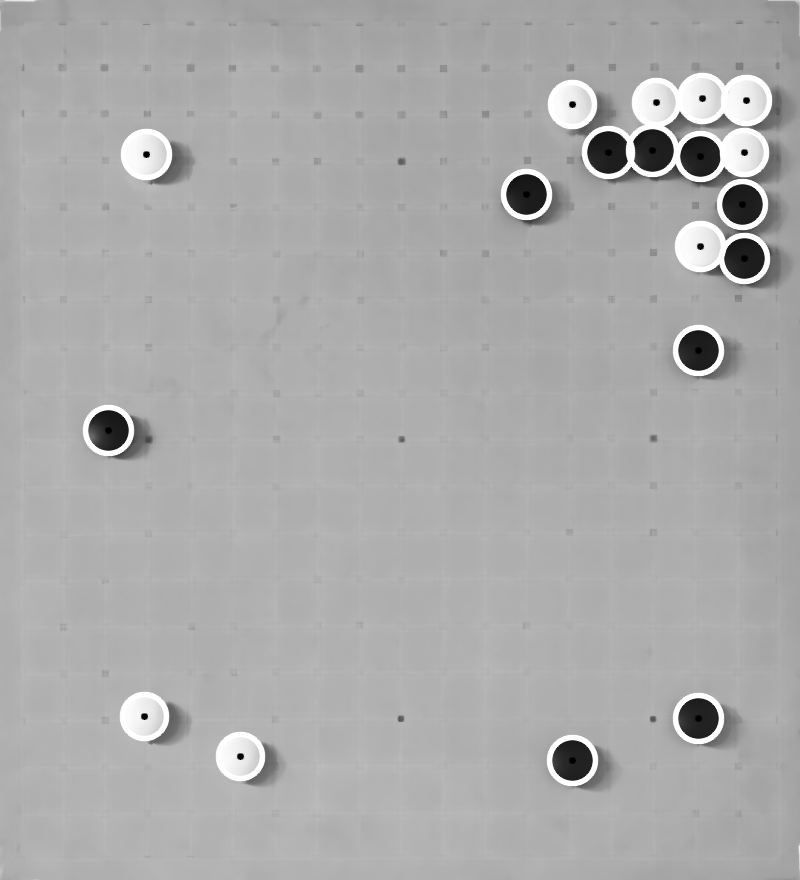

# gobonline

Interface a physical Go board with online servers.

This project involves two components:

- Software that watches a physical Go board over a camera and relays those moves to an online Go game.
- Hardware that points at laser onto the physical Go board indicating the opponent's next move.

# Vision components

The CV has two steps: [Board calibration](#board-calibration) and [Stone detection](#stone-detection). It only uses classical computer vision techniques, because that's more fun than ML.

## The setup

Each of the board's corners has an AruCo marker attached to it to help identify the position of the board:

  

## Board calibration

The objective in this step is to find the offest of the Go board's grid corners relative to the AruCo markers.

The only assumptions about these markers is that they'll be aligned with the board's grid. They can be any distance from the actual corners of the grid, however.

We first detect all the AruCo markers, then perform perspective shift and adaptive equalization. This looks like:

Original |  Shifted and equalized
:-------------------------:|:-------------------------:
 | 

Then, for each line direction (horizontal and vertical), we apply a filter and then perform canny edge detection.

Shifted & equalized |  Filtered | Edges
:-------------------------:|:-------------------------:|:-------------------------:
 |  | 

Shifted & equalized |  Filtered | Edges
:-------------------------:|:-------------------------:|:-------------------------:
 |  | 

Then we fit a 19x19 2D grid to the detected lines to determine grid dimensions and where the grid lines are relative to the AruCo markers to save those offsets for later.

## Stone detection

After calibration, we know exactly where every intersection of the Go board is relative to the AruCo markers.

To find the stones, we find AruCo markers, run a series of blurs and morphological operations and blurs, then perform Hough circle detection:

Original | With perspective shift | With Hough Circles
:-------------------------:|:-------------------------:|:-------------------------:
 |  | 

We know where every grid intersection is from the [Board calibration](#board-calibration) step, so we just pick the closest grid intersection for each detected circle to find its location, and we use a simple threshold on the color of the circle to determine whether the stone is black or white.
